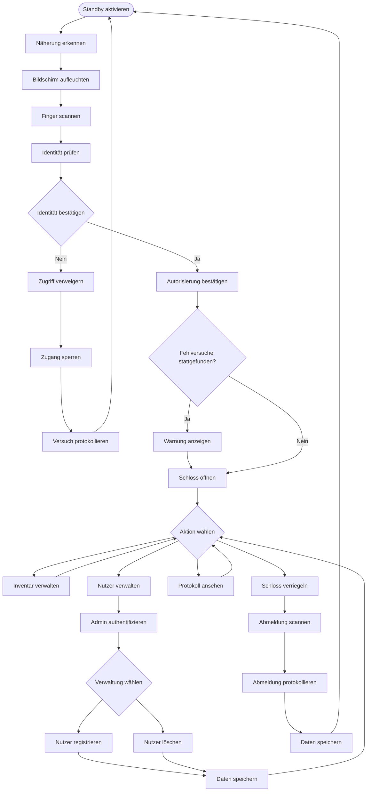
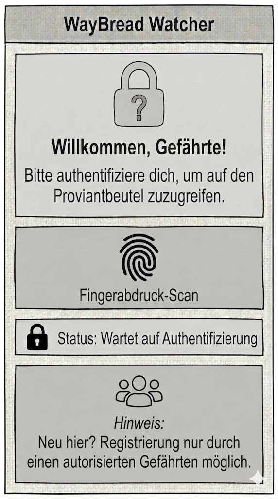

# The Fellowship Companion – Artifact II: Deciding  

---

## Table of Contents

- **[1. System Capability](#1-system-capability)**
- **[2. Flow](#2-flow)**
- **[3. Wireframe](#3-wireframe)**
- **[4. Design Rationale](4-design-rationale)**

---

## 1. System Capability  

> **Gollum-Proofing**
 

### Capability Description  
Die von uns gewählte Capability ist die Sicherheitsmaßnahme, die den Rucksack verschließt. Um zu verhindern, dass Gollum oder andere unerwünschte User auf den Rucksack und seine Inhalte zugreifen können, haben wir einen Verschließmechanismus eingebaut. Dieser funktioniert per Scan des Fingerabdrucks und lässt somit nur vom Admin berechtigte User auf die Inhalte zugreifen.  
 
### Why this capability?
Ausgewählt haben wir diese Capability, weil sie einerseits essenziell für die Sicherheit unserer Reise ist und andererseits, weil diese Capability, das richtige Maß an Komplexität für diese Arbeitsaufgabe bzw. für das erste Mal hat. Wir wollten keine zu schiwerige Capability für unseren ersten Versuch der Beschreibung auswählen, aber dennoch eine, die genug Inhalt für die Aufgabe bietet.  
Außerdem ist die gewählte Capability für unsere weiteren geplanten Capabilities sehr wichtig. Die spezienbasierte Verbrauchsrechnung zum Beispiel baut auf den in der Sicherheismaßnahme erstellten Nutzerprofilen auf. Auch für den Inventory-Tracker ist es essenziell, dass nicht jeder X-beliebige Mittelerdebewohner auf unseren Rucksack Zugriff hat und womöglich Proviant stehlen kann. Das Schloss ist somit logisch gesehen, der erste Schritt.  
 
### Why is it meaningful for us at this stage of the journey?  
Obwohl wir uns aktuell in der Formierungs- und Planungsphase in Bree und Bruchtal befinden – und die akute Bedrohung durch Gollums Sabotage oder extremer Hunger noch in der Zukunft liegen – ist genau jetzt der entscheidende Zeitpunkt für die Entwicklung dieses Features. Wir betreiben hier eine vorausschauende Sicherheitsplanung: Ein sicheres Zugriffssystem muss entwickelt und getestet werden, bevor wir in feindliches Gebiet aufbrechen. Wenn wir erst in Mordor merken, dass uns Vorräte gestohlen werden, haben wir weder die Zeit noch die sichere Umgebung, um eine Lösung zu bauen.  
Gleichzeitig adressiert dieses System schon jetzt ein zentrales Problem der Gruppendynamik: Der Rat von Elrond hat gezeigt, dass die Gefährten aus verschiedenen Völkern stammen und die korrumpierende Macht des Ringes leicht Misstrauen säen kann (wie z. B. bei Boromir). Ein fälschungssicheres, objektives Zugangssystem durch Biometrie etabliert von Anfang an klare Regeln. Es schützt uns also nicht nur vor externen Feinden, sondern schafft auch intern Vertrauen, bevor Paranoia oder Ressourcenknappheit die Mission von innen heraus gefährden können.

---  

## 2. Flow  

> **[Flowchart](src/decisions.mermaid.md)**

 

1. **Standby aktivieren**  
Das System befindet sich im Ruhezustand. und wird durch Bewegung oder Annäherung geweckt.
2. **Näherung erkennen**  
Wenn sich jemand dem Rucksack nähert, dann erfasst das der Sensor. Dadurch erkennt das System eine Näherung.  
3. **Bildschirm aufleuchten**  
Der Bildschirm leuchtet durch die Annäherung auf und zeigt unser Wireframe. Der Erkennungsprozess wird eingeleitet.  
4. **Finger scannen**  
Die Person legt den Finger auf den Bildschirm. Der Finger wird gescannt.  
5. **Identität prüfen** 
Der gescannte Fingerabdruck wird mit den gespeicherten Identitätsdaten abgeglichen. 
6. **Identität bestätigen**
    + Nein: Bei einer fehlgeschlagenen Identitätsprüfung wird der Zugriff verweigert, der Zugang gesperrt, der Versuch protokolliert, und damit kehrt das System zurück auf Standby.  
    + Ja: Bei einer erfolgreichen Identitätsprüfung bestätigt das System die Autorisierung.  
7. **Fehlversuche stattgefunden?**  
Gab vor der letzten erfolgreichen Anmeldung einen fehlgeschlagenen Versuch, in das System zu kommen?  
    + Ja: Ein Popup-Fenster taucht auf mit der Information, dass jemand sich versucht hat, einzuloggen.  
    + Nein: Es taucht kein Popup-Fenster auf. Weiter zu Punkt 9.
8. **Schloss öffnen**  
Das Schloss wird entriegelt und somit kann in weiterer Folge das Aktionsmenü bedient werden. 
9. **Aktion wählen**  
Der Nutzer sieht das Aktionsmenü und kann zwischen folgenden Optionen wählen  
    + Inventar verwalten: Die Systemoption "Inventar verwalten" verschafft den Zugriff ausschließlich auf das Inventar, daher kehrt das System nach der Nutzung zurück auf die Aktionsmenü. 
    + Nutzer verwalten: Unter “Nutzer verwalten" muss sich der Admin mit Fingerabdruckscan authentifizieren, um Zugriff auf die Verwaltung der Nutzer zu bekommen. NAch erfolgreicher Authentifizierung kann er neue Nutzer registrieren oder gespeicherte Nutzer löschen. Diese Daten werden anschließend gespeichert, und der Nutzer kann auf das Aktionsmenü zurückkehren. 
    + Protokoll ansehen: "Protokoll ansehen" ermöglicht dem Nutzer jegliche vom System erstellen Protokolle einzusehen. Nach der Einsicht kehrt das System zurück auf "Aktion wählen". 
    + Schloss verriegeln: Bei der Option "Schloss verriegeln" wird der Benutzer aufgefordert, durch Fingerabdruckscan die Abmeldung einzuleiten. Anschließend wird die Abmeldung protokolliert, sowie die Daten gespeichert und das System kehrt in “Standby aktivieren” zurück.

  
⚙️ System-Setup

  

---  

## 3. Wireframe

> **[Wireframe](src/decisions.png)**  

 

---

## 4. Design Rationale  

### How does this design support the intent and value defined in your Assignment 1?  
Das Design des ersten Wireframes ist die “Login-Maske” für registrierte Gefährten. Durch das Login haben wir erstens direkten Zugang zu den Inhalten des Rucksacks, zweitens sind sie auch vor ungewollten Mitbenutzern geschützt. Unser Wireframe setzt auf eine strikte biometrische Authentifizierung (Fingerabdruck-Scan). Da Passwörter von Dritten belauscht oder erraten werden könnten, bietet der biometrische Zugang die absolut höchste Sicherheit. Gollum z.B. kann das System nicht öffnen, keine Rationen fälschen und keinen Zugriff auf den Proviantbeutel erlangen. Das große Schloss-Symbol und das Fingerabdruck-Symbol visualisieren diese kompromisslose Sicherheit. Außerdem gibt die Hinweismeldung die Information, dass eine Registrierung nicht ohne einen autorisierten Gefährten möglich ist. Das Design ist simpel gehalten, da in einer Umgebung mit toxischen Dämpfen und Hitze, sowie bei mentaler und/oder physischer Erschöpfung von uns Gefährten kognitive Anstrengung nicht von Vorteil ist. Die Schrift ist auch deswegen groß gehalten. Der Fingerabdruck ist mittig platziert, damit er füruns alle ersichtlich ist und gut benutzt werden kann. Die klare Statusmeldung („Status: Wartet auf Authentifizierung“) und der Hinweis unten („Registrierung nur durch autorisierte Gefährten“) stellen sicher, dass es ein in sich geschlossenes, sicheres System ist, was objektives Vertrauen zwischen den uns als Gefährten fördert.  
  
### What did you deliberately leave out?  
Auf dem Login-Screen gibt es keine Passwort-Eingabe und keinen “Passwort vergessen?”-Button, weil wir uns bewusst gegen ein passwortgeschütztes System entschieden haben. Die Gründe dafür sind, dass man auf so einer anstrengenden Reise eher einfache Passwörter verwendet, weil man sonst Gefahr läuft, sie zu vergessen.  Einfache Passwörter können von anderen schnell erraten werden. So können wir unsere Gedächtnisleistung für die Reise aufsparen. Daher gibt es auch keinen Nummernblock für eine PIN-Eingabe und keine Textfelder zur Passworteingabe. Es gibt auch keinen Gast-Zugang oder “Skip”-Button, damit der Weg des autorisierten Logins auf keinen Fall umgangen werden kann. Die harte Barriere schützt die “WayBread Watcher"-Datenbank.  
  
### What assumptions or constraints influenced your design?  
+ Der Screen ist visuell sehr übersichtlich und kontrastreich gestaltet, damit man ihn auch im Dark-Mode verwenden kann. Dadurch wird das Risiko, von Feinden entdeckt zu werden, minimiert.  
+ Der Status “Wartet auf Authentifizierung” impliziert, dass das System lokal arbeitet, weil es keine Ladebalken gibt, die “Verbinde mit dem Server” anzeigen. Egal, ob es in Mittelerde eine gute Internetverbindung gibt oder nicht, kann das Gerät lokal und offline betrieben werden, sodass der Nahrungsversorgung nichts im Weg steht.  
+ Die freundliche Sprache senkt unsere Hemmschwelle, da wir nicht technikvertraut sind, und baut das nötige Vertrauen in die Maschine auf.  
+ Außerdem kann der Rucksack auch bei großer Erschöpfung und zittrigen Händen bedient werden, da die Buttons groß gehalten sind.  

