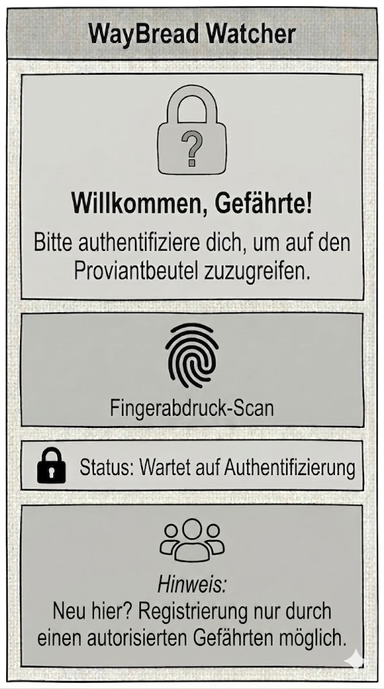

# The Fellowship Companion – Artifact III: Representation  

> "He’s eaten it! He’s eaten it all! He’s finished the last of our lembas!" — Gollum

---

## Table of Contents

**[1. System Capability](#1-system-capability)**  
**[2. Static Interface](#2-static-interface)**  
**[3. Design Rationale](#3-design-rationale)**  

---

## 1. System Capability  

> **Gollum-Proofing**
 

### Capability Description  
Die von uns gewählte Capability ist die Sicherheitsmaßnahme, die den Rucksack verschließt. Um zu verhindern, dass Gollum oder andere unerwünschte User auf den Rucksack und seine Inhalte zugreifen können, haben wir einen Verschließmechanismus eingebaut. Dieser funktioniert per Scan des Fingerabdrucks und lässt somit nur vom Admin berechtigte User auf die Inhalte zugreifen.  
 
### Why is it meaningful for us at this stage of the journey?  
Das biometrische Zugangskontrollsystem wurde bewusst als erste Capability gewählt: Es ist komplex genug, um inhaltlich relevant zu sein, aber handhabbar genug für einen ersten Implementierungsversuch. Vor allem aber ist es das logische Fundament für alles, was folgt, die speziesbasierte Verbrauchsrechnung baut auf den hier erstellten Nutzerprofilen auf, und der Inventory-Tracker funktioniert nur, wenn der Zugriff auf den Rucksack kontrolliert ist. Ein objektives, fälschungssicheres Zugangssystem schafft von Anfang an klare Regeln und schützt die Gemeinschaft nicht nur vor externen Bedrohungen wie Gollum, sondern auch vor dem Misstrauen, das von innen entstehen kann.

---  

## 2. Static Interface

> **[Wireframe](../artifact-2/src/decisions.png)**  
> **[HTML](src/interface.html)**  
> **[Stylesheet](src/style.css)**  

  
  

    
  

 

---

## 3. Design Rationale  

### How does this interface support the intent and value defined in Assignment 1?  
Das Interface dient als „Gatekeeper“ für den Proviantbeutel der Gefährten und setzt den geforderten Schutz vor unbefugtem Zugriff und Manipulation visuell um.  
+ Erste Sektion: Da die erste Information eine Aufforderung ist, sich zu authentifizieren, wird klargestellt, dass der Zugriff zum Proviantbeutel nicht öffentlich ist.
+ Stealth- & Dark-Mode mit hohem Kontrast: Um Lichtemissionen in feindlichem Gebiet zu vermeiden, haben wir einen sehr dunklen, grünlichen Hintergrund gewählt. Um jedoch unter erschwerten Bedingungen die Lesbarkeit zu garantieren, nutzen wir bewusst eine weiße, kontrastreiche Schrift. So bleibt das Display unauffällig für Feinde, aber klar erkennbar für die Gefährten.  
+ Typografie für maximale Lesbarkeit: Wir haben ganz bewusst auf verschnörkelte Fantasy-Schriften verzichtet. In einer extremen Überlebenssituation muss der Text auf den ersten Blick mühelos lesbar sein, weshalb wir eine klare, schnörkellose Standardschrift gewählt haben. Überschriften sind fett gedruckt, während sich der Text darunter durch mehr Abstand und eine leicht abgedimmte, andere Farbe visuell sauber abtrennt. Das schafft Übersichtlichkeit und lässt die App wie ein seriöses Überlebenswerkzeug wirken.
+ Gezielte Interaktions-Boxen: Wir haben Rahmen und Kästchen ganz bewusst nur bei den Elementen „Fingerabdruck“ und „Status“ eingesetzt, was sich von unserem Wireframe auch unterscheidet. Das signalisiert dem Nutzer sofort, dass nur diese beiden Bereiche interaktiv sind oder System-Feedback geben.  
+ Button-Differenzierung: Der Fingerabdruck-Scan ist das größte Element auf dem Bildschirm, da dieser Bereich die wichtigste und zentrale Aktion darstellt. Um dem Nutzer klarzumachen, dass nicht beide Boxen zum Klicken gedacht sind, unterscheiden sie sich deutlich in der Hintergrundfarbe. Man erkennt intuitiv: Die große Box ist der Button zum Drücken, die andersfarbige Status-Box spuckt lediglich Informationen aus.  
+ Wortwahl: Ausdrücke wie „Mae Govannen“, „Gefährte“ oder „Proviantbeutel“ passen zum narrativen Kontext der Welt, in der wir uns befinden.  
+ Präzise Handlungsaufforderungen (Microcopy): Um die Benutzerführung zu optimieren, haben wir die Texte im Vergleich zum Wireframe klarer und aktiver formuliert. Aus einem passiven „Fingerabdruck-Scan“ wurde die direkte Anweisung „Finger auflegen und scannen“. Ebenso wurde der Begrüßungstext konkretisiert („um den Proviantbeutel zu öffnen“ statt nur „für den Proviantbeutel“). So werden Missverständnisse vermieden und auch Erstnutzer sicher durch den Prozess geführt.
+ Kein Scrollen (Single-Screen-Design): Wir haben das Interface ganz bewusst so gestaltet, dass sämtliche Elemente auf einen einzigen Blick erfassbar sind und auf keinen Fall gescrollt werden muss. Die App ist so programmiert, dass sie sich dynamisch an die Höhe der verschiedenen Handy-Displays anpasst. Die wichtigste Aktion, der Fingerabdruck-Scan, ist sofort und ohne Umwege erreichbar, denn jedes zusätzliche Wischen oder Suchen würde wertvolle Zeit kosten.
   

### How does it reflect the wireframe from Assignment 2?  
Die Implementierung ist eine direkte Übersetzung des Wireframes in echten Code.  
+ Strukturtreue: Die vertikale Anordnung wurde exakt beibehalten: Die oberste Sektion dient der Begrüßung, die mittlere der Interaktion und die untere der Information – genau wie in der Skizze vorgegeben. Die visuelle Hierarchie führt das Auge genau wie im Wireframe von oben nach unten.
+ Responsive App-Look: Eine bewusste Weiterentwicklung vom reinen Wireframe ist die technische Umsetzung als App-Container. Das Interface ist so programmiert, dass es sich dynamisch an alle Handydisplays anpasst. Öffnet man es jedoch auf einem größeren Bildschirm (z. B. am Laptop), wird es durch Media-Queries automatisch zentriert und wie eine eigenständige Smartphone-App mit abgerundeten Ecken und Schatten dargestellt. Das soll das gewünschte "Gadget"-Gefühl bewahren.
+ Sinnvolle Abweichungen bei den Icons: Wir haben die Bildsprache gegenüber dem Wireframe optimiert, um sie logischer zu machen. Statt des Schloss-Symbols bei der Begrüßung haben wir eine winkende Hand eingesetzt, was deutlich besser zur Formulierung „Mae Govannen“ (Willkommen) passt. Unten beim Hinweis haben wir die Personengruppe durch ein klassisches Informationszeichen ersetzt, um unmissverständlich klarzumachen, dass es sich hierbei um eine reine Info handelt.
+ Sinnvolle Abweichung bei Boxen und Text: Wie wir, die Hobbits, oben bereits erwähnt haben, haben wir bewusst die Rahmen um die Begrüßung und die Information weggelassen, damit man intuitiv merkt, dass da nichts zum Klicken ist. Außerdem haben wir den Text in Handlunsgaufforderungen umformuliert, um eine präzise Ausdrucksweise zu gewährleisten und Missverständnisse zu vermeiden.  
   

### What did you deliberately not implement yet?  
Um den Fokus auf die Struktur zu legen, wurden folgende Aspekte bewusst weggelassen:  
+ Interaktivität: Alle Buttons sind rein statisch. Es findet noch keine echte biometrische Prüfung statt. Genauso gibt es noch keine Weiterleitung zum Hauptmenü oder anderen Seiten.
+ Verschönerungen: Es wurden keine modernen CSS-Effekte wie Verläufe oder Animationen verwendet, um die Struktur übersichtlich zu halten. Komplizierte Designs können überfordernd wirken.
+ Less is more: Obwohl wir gezielt schlichte Icons (wie die winkende Hand oder das Info-Zeichen) zur schnellen Orientierung einsetzen, haben wir ganz bewusst auf bunte Emojis, aufwendige Bilder oder Animationen verzichtet. In einer extremen Überlebenssituation gilt strikt das Prinzip „weniger ist mehr“ – jedes überflüssige visuelle Detail lenkt nur ab. Das Interface soll nicht wie ein Spiel wirken, sondern Ernsthaftigkeit und Verlässlichkeit ausstrahlen.
   

### What assumptions or constraints shaped your decisions?  
+ Nutzerverhalten: Wir haben angenommen, dass die Gefährten lesen können und mit Touch-Bildschirmen vertraut sind. Weiters gehen wir davon aus, dass die Benutzer wissen, was ein Fingerabdruck-Scan ist, weswegen wir auch keine erklärenden Textfelder eingebaut haben.
+ Admin: Wir gehen davon aus, dass es bereits einen registrierten und autorisierten Gefährten gibt (z.B. Maxwise), der den Proviant verwaltet.  
+ Energie & Hardware: Wir nehmen an, dass das Gerät seine Energie mühsam (Solar/Kinetisch) beziehen muss. Um den Akku zu schonen, haben wir das CSS extrem minimalistisch und ressourcenschonend programmiert: Wir nutzen reine Volltonfarben statt rechenintensiver Farbverläufe, verzichten auf Animationen und verwenden einfache Systemschriften. Das und der dunkle Hintergrund simulieren einen energiesparenden Betrieb auf einem robusten Display.
+ Kognitive Belastung: Wir gehen davon aus, dass die Gefährten auf der Reise physisch und mental extrem erschöpft sind (Hunger, zittrige Hände). Daher ist der Scanner extrem groß gehalten, und die Benutzeroberfläche bleibt simpel. Durch unsere klaren Text-Aufforderungen ("Finger auflegen...") nehmen wir den Nutzern in stressigen Situationen Denkarbeit ab.
+ Offline-Betrieb & Zuverlässigkeit: Da es in Mittelerde kein Netz gibt, zeigt der Status keine Ladebalken für Serververbindungen an. Das Design suggeriert ein lokales, sofort reagierendes System (Edge Computing).
