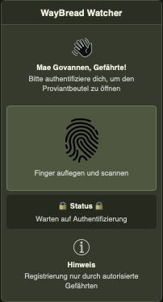

# The Fellowship Companion – Artifact III: Representation  

> "He’s eaten it! He’s eaten it all! He’s finished the last of our lembas!" — Gollum

---

## Table of Contents

- **[1. System Capability](#1-system-capability)**
- **[2. Static Interface](#3-static-interface)**
- **[3. Design Rationale](4-design-rationale)**

---

## 1. System Capability  

> **Gollum-Proofing**
 

### Capability Description  
Die von uns gewählte Capability ist die Sicherheitsmaßnahme, die den Rucksack verschließt. Um zu verhindern, dass Gollum oder andere unerwünschte User auf den Rucksack und seine Inhalte zugreifen können, haben wir einen Verschließmechanismus eingebaut. Dieser funktioniert per Scan des Fingerabdrucks und lässt somit nur vom Admin berechtigte User auf die Inhalte zugreifen.  
 
### Why is it meaningful for us at this stage of the journey?  
Das biometrische Zugangskontrollsystem wurde bewusst als erste Capability gewählt: Es ist komplex genug, um inhaltlich relevant zu sein, aber handhabbar genug für einen ersten Implementierungsversuch. Vor allem aber ist es das logische Fundament für alles, was folgt, die speziesbasierte Verbrauchsrechnung baut auf den hier erstellten Nutzerprofilen auf, und der Inventory-Tracker funktioniert nur, wenn der Zugriff auf den Rucksack kontrolliert ist. Ein objektives, fälschungssicheres Zugangssystem schafft von Anfang an klare Regeln und schützt die Gemeinschaft nicht nur vor externen Bedrohungen wie Gollum, sondern auch vor dem Misstrauen, das von innen entstehen kann.

---  

## 2. Static Interface

> **[Wireframe](../artifact-2/src/decisions.png)**
> **[HTML](src/interface.html)**

 

---

## 3. Design Rationale  

### How does this interface support the intent and value defined in Assignment 1?  
Das Interface dient als „Gatekeeper“ für den Proviantbeutel der Gefährten. 
Durch die prominente Platzierung der Authentifizierung wird klargestellt, dass der Zugriff nicht öffentlich ist. Dies schützt die wertvollen Inhalte vor unbefugtem Zugriff.
Die Wortwahl („Mae Govannen“, „Gefährte“, „Proviantbeutel“) passt zum narrativen Kontext der Welt in der wir uns befinden.
Wir haben dunkle und eher grünliche Farben gewählt, damit diese möglich wenig auffallen wenn der Bildschirm aufleuchtet. Besonders wenn der Bildschirm in der Nacht aufleuchtet, wären helle Farben sehr auffällig für Feinde. Dazu haben wir eine weißliche Schirftfarbe gewählt, damit die Schrift gut lesbar ist.
Der Nutzer erkennt sofort, dass eine Aktion (Scan) erforderlich ist, um den nächsten Schritt im Prozess zu erreichen.
Damit intuitiv erkennbar ist, was ein Button ist und was nicht, haben wir die Buttons mit einem deutlichen Rand hervorgehoben. Grund dafür ist, dass im Wireframe noch nicht ersichtlich war, was Buttons sind und was nicht.  

### How does it reflect the wireframe from Assignment 2?  
Die Implementierung ist eine direkte Übersetzung des Wireframes in Code. Die vertikale Anordnung der sections wurde exakt beibehalten. Die oberste Box dient der Begrüßung, die mittlere der Interaktion und die untere der Information – genau wie in der Skizze vorgegeben.  

### What did you deliberately not implement yet?  
Um den Fokus auf die Struktur zu legen, wurden folgende Aspekte bewusst weggelassen:  
Interaktivität: Alle Buttons sind rein statisch. Es findet noch keine echte biometrische Prüfung statt. Genauso gibt es noch keine Weiterleitung zum Hauptmenü oder anderen Seiten.  
Verschönerungen: Es wurden keine modernen CSS-Effekte wie Schatten, Verläufe oder Animationen verwendet, um die Struktur übersichtlich zu halten. Komplizierte Designs können überfordernd wirken.  
 
### What assumptions or constraints shaped your decisions?  
Wir gehen davon aus, dass der Bildschirm auf dem Rücksack stets die selbe Größe hat und nicht anpassungsfähig sein muss. Wir haben angenommen, dass die Gefährten lesen können und mit Touch-Bildschirmen vertraut sind. Weiters gehen wir davon aus, dass die Benutzer wissen, was ein Fingerabdruck-Scan ist, weswegen wir auch keine erklärenden Textfelder eingebaut haben. Wir gehen davon aus, dass es bereits einen registrierten und autorisierten Gefährten gibt (z.B. Maxwise). Wir haben die Benutzeroberfläche so simpel wie möglich gehalten, damit sie auch in stressigen Situationen schnell und fehlerfrei bedient werden kann.   
